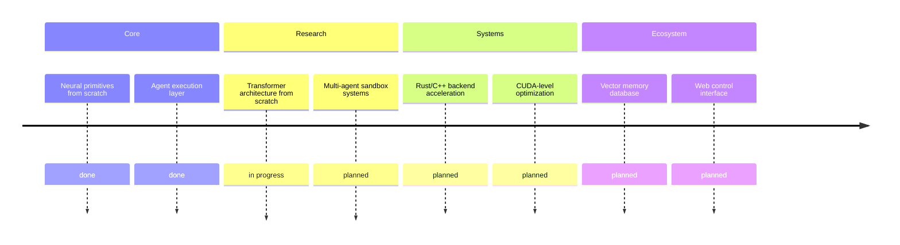
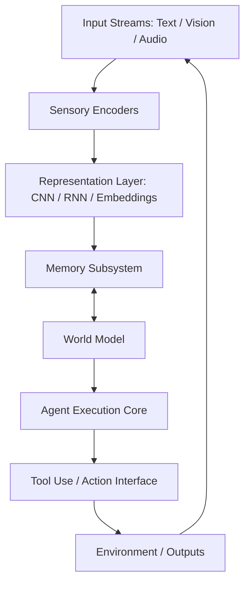
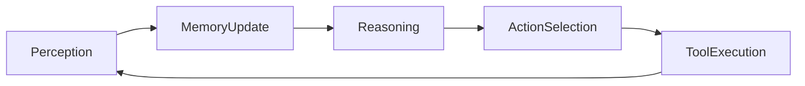

# Adaptive eXecution Neural Layer (axnl)

**AXNL (Adaptive eXecution Neural Layer)** is a general agentic framework designed for maximum control, transparency, and architectural flexibility. Built in **pure Python** (with optional future support for Rust/C++ extensions), AXNL enables construction of neural systems from first principles using either hand-coded components or low-level PyTorch modules, while  avoiding reliance on pretrained black box models.

AXNL prioritizes **modularity**, **agentic reasoning**, **interpretability**, and **low-level performance control**, making it a foundation for research, experimentation, and production-grade AI systems without external model dependencies.

---

## Why AXNL?

Most modern AI frameworks abstract away computation behind pretrained models, trading transparency for convenience. AXNL takes the opposite approach by:

- Exposing fundamental neural computation primitives
- Enabling full control over model architecture, training, and optimization pipelines
- Providing an **agentic execution system** with memory, planning, tool use, and multi-step reasoning
- Remaining lightweight, composable, and fully inspectable

AXNL is built for developers and researchers who want to construct intelligence systems from the ground up, not just interface with them.

---



## Core Features

- Pure Python core with minimal abstraction
- Custom neural systems (MLPs, CNNs, RNNs, attention mechanisms)
- Agentic execution layer with memory and planning
- Tool use and inter-agent communication
- Sensor fusion support (vision, audio, structured data)
- Training + debugging toolchain (optimizers, schedulers, logging)
- Extensible backend path for Rust/C++ + CUDA acceleration
- No pretrained model dependencies

---

## Architecture Overview



## Agent Execution Loop

## Quickstart

Clone the repository
```git clone https://github.com/anipaleja/AXNL.git```
```cd axnl```
Install dependencies
```pip install -r requirements.txt```

Optional backend acceleration:

```pip install torch```
Run your first agent
```python main.py --mode basic```

## Configuration

All system behavior is defined via `.yaml` or `.json` files in `configs/`.
```yaml
agent:
  name: AXN-Agent
  memory: episodic
  reasoning: recurrent
  actions: [math, text_output]

model:
  type: MLP
  layers: [128, 256, 128]
  activation: relu

training:
  optimizer: sgd
  learning_rate: 0.001
  epochs: 100
```

## Examples
`examples/minimal_agent.py` — basic agent built from scratch
`examples/memory_test.py` — persistent memory system
`examples/sensor_fusion.py` — multi-modal input fusion
`examples/low_level_torch.py` — raw PyTorch implementation

---

## Contributing

AXNL is designed to be modular and extensible.

#### Guidelines: 
- Keep modules independent and composable
- Avoid unnecessary dependencies
- Document all components clearly
- Include tests for new functionality

```bash
flake8 axnl/
pytest tests/
```
## License

`MIT License`
You are free to use, modify, and distribute this project with attribution. Closed source forks are not permitted.

## Acknowledgements

Inspired by early neural systems, modern agent frameworks like AutoGPT and BabyAGI, and the goal of building fully transparent AI systems from first principles.
